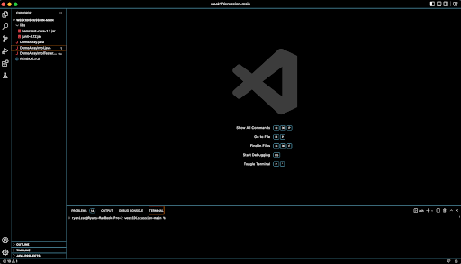
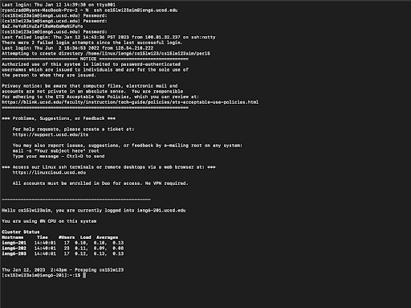

# Lab Report #1

**1. Installing VS Code**

I already had VS code installed on my device due to my previous computer science class. However, installing VS code is as easy as typing it into the search bar and downloading the software straight from the website; there is not much setup required. 

**2. Remotely Connencting**

Given a course specific account for CSE15, I can remotely connect to a computer from the lab by typing the command '$ ssh cs15lwi23zz@ieng6.ucsd.edu', with the "zz" replaced by "aim" for my own personal account. After executing the command, it was my first time connnecting to this source so I had to confirm with "yes". After that I was prompted to enter my password and proceeded to successfully connect to my lab computer. 

**3. Trying Some Commands**

After testing random commands on my remote computer's terminal, I decided to run the 'ls -lat' command on my own terminal in VS code. Since I was in my user working directory (/Users/ryanizad/), the command listed each of my user's files along with their date and time of most recent modification. 

