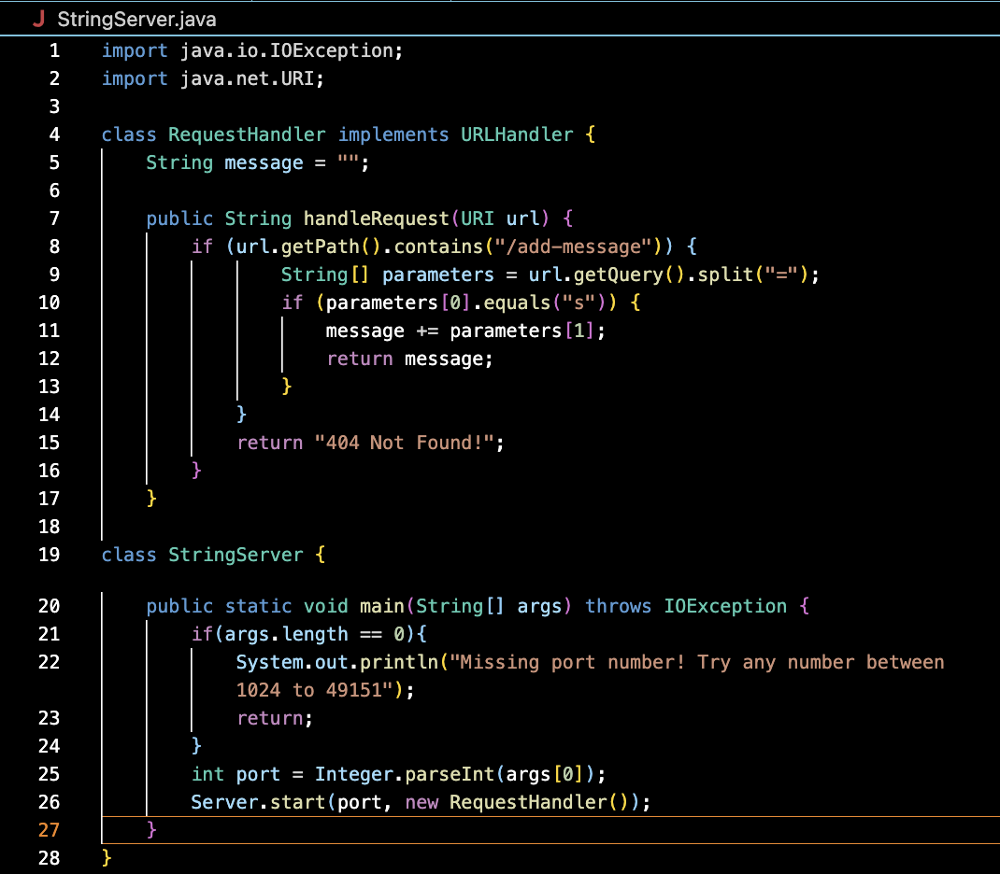
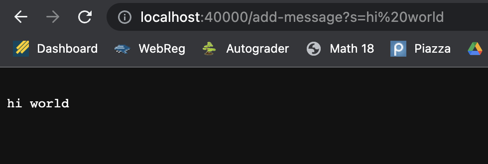
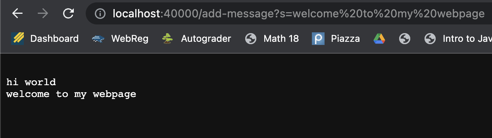
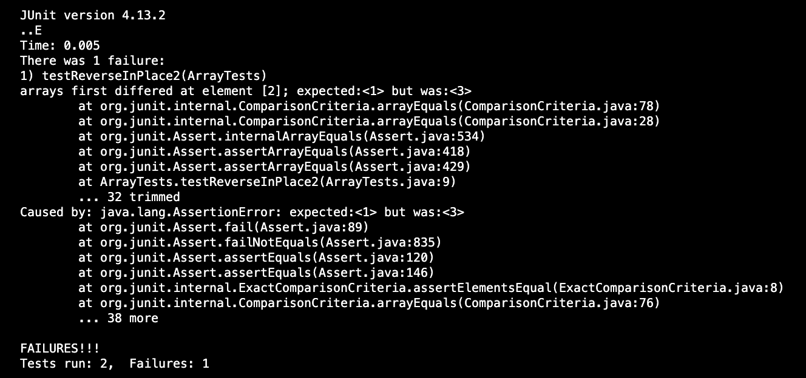

# Lab Report #2

**Part 1: StringServer**



*Code for StringServer.java*



By typing in "/add-message?s=hi world" as the path of my local server, both of the if statements in `handleRequest()` execute and split everything past the "?" (by utilizing `getQuery()`) into a string array called *parameters*. The second item of the array (the string after the "=") is added to a local string variable in the RequestHandler class called *message*. Message is then returned and displayed on screen. 



Upon typing in "/add-message?s=welcome to my webpage" as the path, the same process occurs as before, except this time the previous message also remains stored in the message String. Each time a string is added to message via url path, a line split is added to message to present each added string as a line after the old one. In this case, StringServer displayed: 
"hi world"
"welcome to my webpage"

**Part 2: ReverseInPlace Bug**

*Failure-inducing input*

```
public class ArrayTests {
  @Test
  public void testReverseInPlace2() {
    int[] input1 = {1,2,3};
    ArrayExamples.reverseInPlace(input1);
    assertArrayEquals(new int[]{3,2,1}, input1);
  }
}
```

*Non-Failure inducing input*

```
public class ArrayTests {
	@Test 
	public void testReverseInPlace1() {
    int[] input1 = { 3 };
    ArrayExamples.reverseInPlace(input1);
    assertArrayEquals(new int[]{ 3 }, input1);
	}
}
```

*Symptoms of Tests*



*The Bug*

Before

```
public class ArrayExamples {
  // Changes the input array to be in reversed order
  static void reverseInPlace(int[] arr) {
    for(int i = 0; i < arr.length; i += 1) {
      arr[i] = arr[arr.length - i - 1];
    }
  }
```

After

```
public class ArrayExamples {
  // Changes the input array to be in reversed order
  static void reverseInPlace(int[] arr) {
    for(int i = 0; i < arr.length/2; i += 1) {
      int temp = arr[i];
      arr[i] = arr[arr.length - i - 1];
      arr[arr.length - i - 1] = temp; 
    }
  }
```
The problem with the original code is that without a temporary variable, the middle values of the array would not be reversed correctly and recopied to their original place in the array. There's also no need to have the for loop iterate the entire length of the array, since both sides of the array are accessed at once. By utilizing a temporary variable and dividing the array length by 2, each element in the array is accessed once and copied to its target position. 

**Part 3**

Although I've already experienced Lab 3's junit testing in CSE12, Lab 2 was the introduction of an entirely new topic, web servers. Although I don't fully understand how the Server.java file actually works, I learned how to implement my own local web server and to handle requests within the url by utilizing common url commands such as `getPath()` and `getQuery()`. I also learned how to run my web server remotely through the cse servers, by logging onto my remote account and transferring the server java files using the scp command, then running the files through the remote terminal. 


