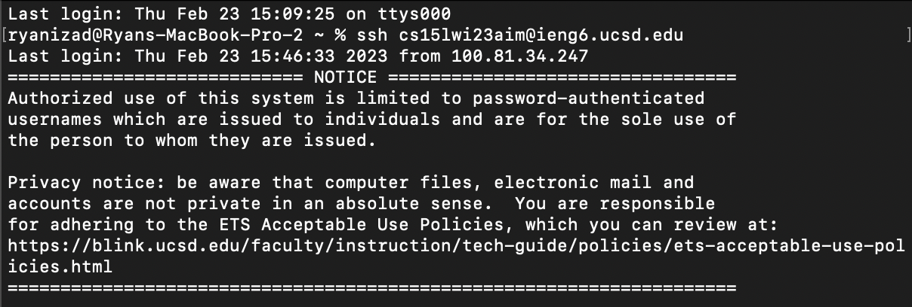
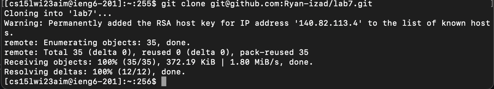
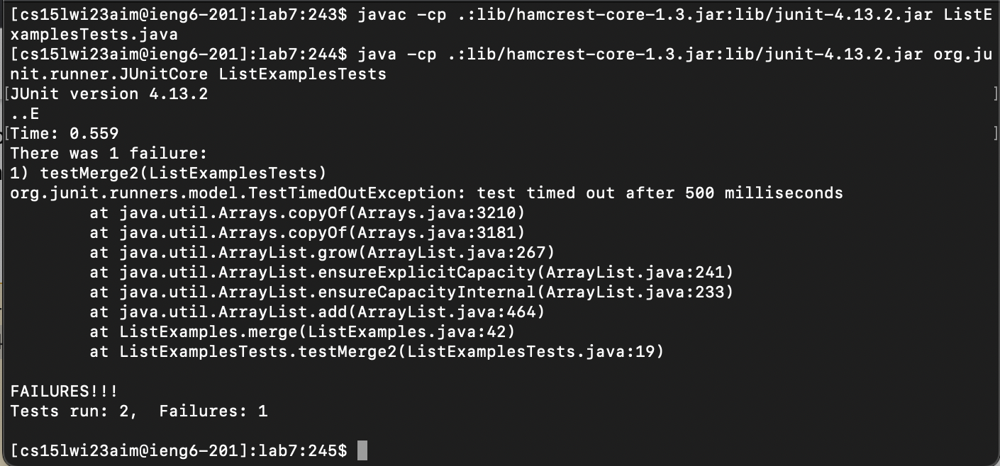
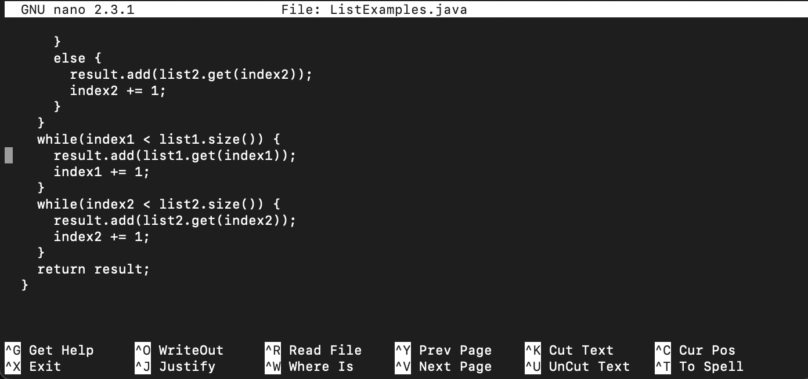
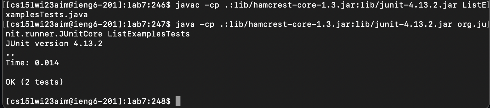
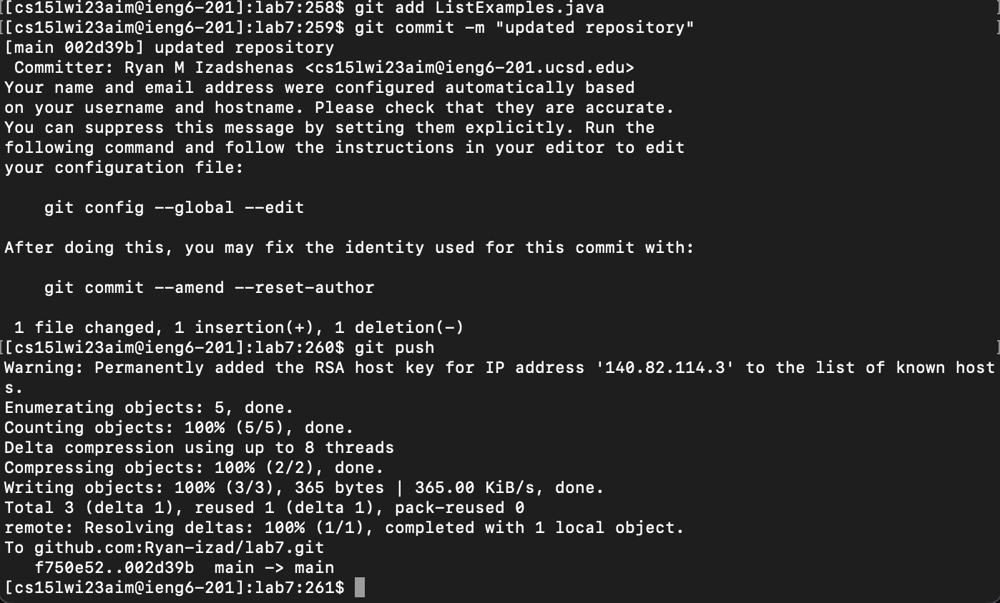

# Lab Report 4

## Steps 4 - 9

**4. Log into ieng6**

Keys pressed: 
`ssh cs15lwi23aim@ieng6.ucsd.edu <enter>`

**5. Clone the repository** 

Keys pressed: 
`git clone <ctrl v> <enter>`
  
**6. Run the tests**

Keys pressed: 
`cd lab7 <enter>`
`<ctrl r> javac <tab> <enter>`
`<ctrl r> java <tab> <enter>`

**7. Fix the failing code**

Keys pressed:
`nano ListExamples.java <enter>`
`<scroll down> <right x 12> <backspace> 2`
`<ctrl o> <enter> <ctrl x>`

**8. Rerun the tests**

Keys pressed: 
`<up><up><up><enter>`
`<up><up><up><enter>`

**9. Push changes to Github**

Keys pressed:
`git add List <tab> .java <enter>`
`git commit -m "updated repository" <enter>`
`git push`
