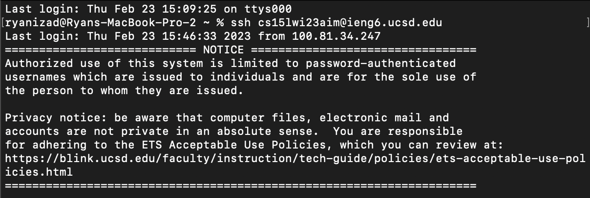
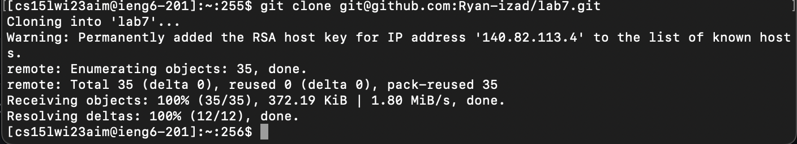
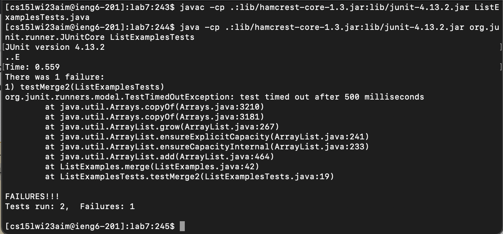
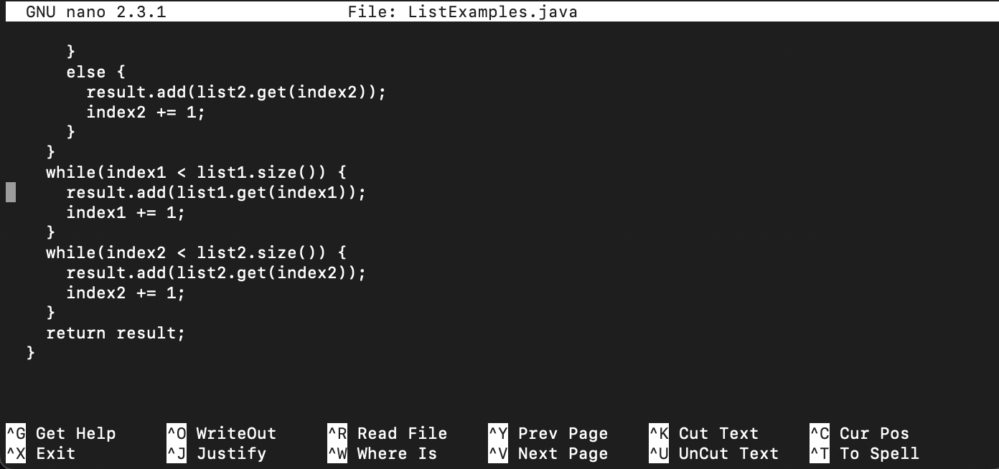
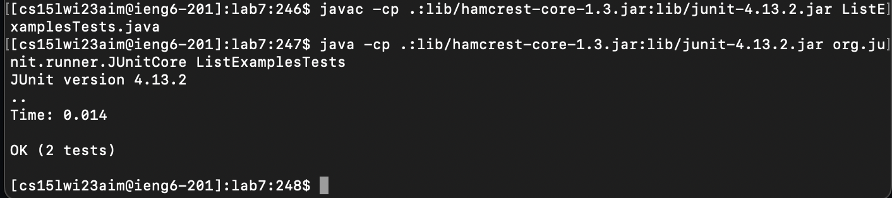
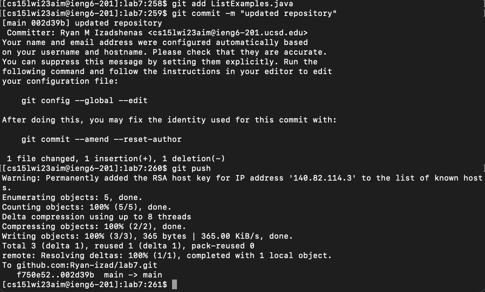

# Lab Report 4

## Steps 4 - 9

**4. Log into ieng6**

Keys pressed: 
`ssh cs15lwi23aim@ieng6.ucsd.edu <enter>`

Typed out the entire remote connection command.

**5. Clone the repository** 

Keys pressed: 
`git clone <ctrl v> <enter>`
  
Previously copied the github ssh clone url, so all I had to do was type out git clone and paste the link. 
 
**6. Run the tests**

Keys pressed: 
`cd lab7 <enter>`
`<ctrl r> javac <tab> <enter>`
`<ctrl r> java <tab> <enter>`

Switched into the cloned directory with cd, utilized the command search shortcut (ctrl r) and typed the beginning of the compile and run commands for j unit since they were recently in my history. Pressed tab to autocomplete these commands and entered. 

**7. Fix the failing code**

Keys pressed:
`nano ListExamples.java <enter>`
`<scroll down> <right x 12> <backspace> 2`
`<ctrl o> <enter> <ctrl x>`

Nanoed into the file to edit, scrolled down to the error line, used the "right" key to reach the wrong code, delete the "1" in the original code, and replace it with a 2 to properly implement `merge()`

**8. Rerun the tests**

Keys pressed: 
`<up><up><up><enter>`
`<up><up><up><enter>`

I had the compile and run commands for Junit tests in my recent history, so I used the bash up arrow to iterate to the commands and clicked enter.

**9. Push changes to Github**

Keys pressed:
`git add List <tab> .java <enter>`
`git commit -m "updated repository" <enter>`
`git push`

Typed out the git add command while tabbing after List to autofill the correct class. I then committed the added file with a commit message of "updated repository." I then pushed the commit with a git push command. 
