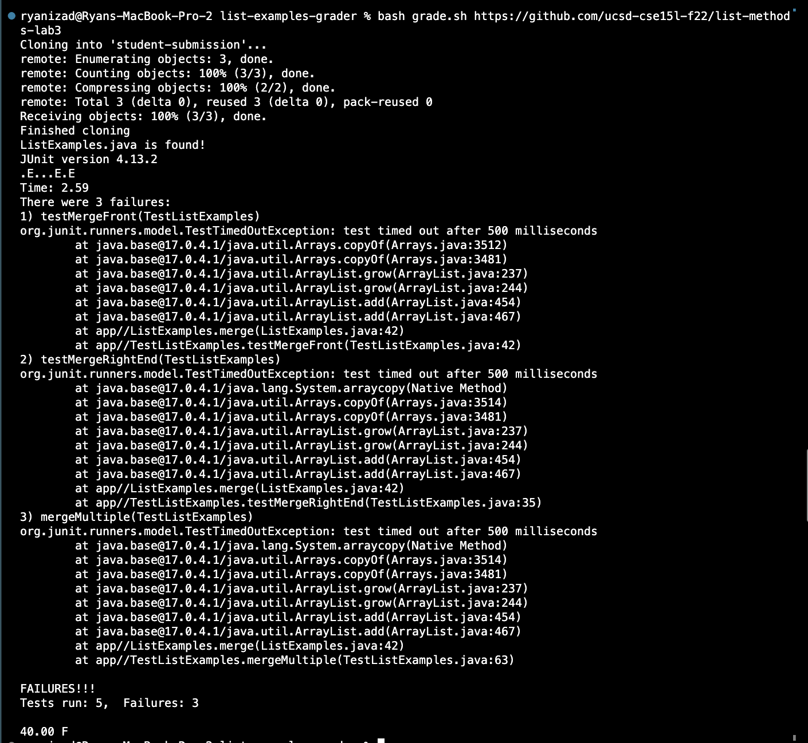
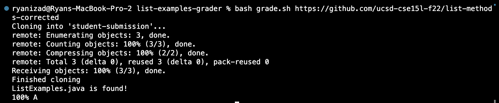
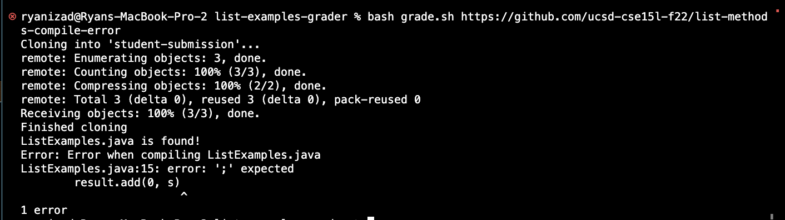
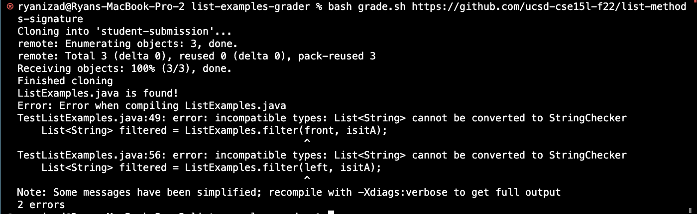

# Lab Report 5

## Finishing my grading script (Lab 6)

This bash script was a bit tough for me to write at first, so I revisited lab 6 and finished my grade.sh

My script is as follows:
```
# Name: Ryan Izadshenas
# Email: rizadshenas@ucsd.edu 
# PID: A17456600
#
# this bash script grades a student submitted ListExamples.java
#

# determine CPath based on operating system
if [[ $(uname) == "Darwin" ]]; then
    CPATH='.:lib/hamcrest-core-1.3.jar:lib/junit-4.13.2.jar'
elif [[ $(uname) == "Linux" ]]; then
    CPATH=".;lib/hamcrest-core-1.3.jar:lib/junit-4.13.2.jar"
fi

# delete previous submission
rm -rf student-submission
git clone $1 student-submission
echo 'Finished cloning'

cp student-submission/ListExamples.java ./

# check if file was found and copied successfully
if [[ $? -ne 0 ]]; then

    echo "Error: ListExamples.java not found in immediate directory"
    exit 1

fi

echo "ListExamples.java is found!"

javac -cp $CPATH *.java 2> compileError.txt

# check if there was an error compiling
if [[ $? -ne 0 ]]; then

    echo "Error: Error when compiling ListExamples.java"
    cat compileError.txt
    exit 1

fi

java -cp $CPATH org.junit.runner.JUnitCore TestListExamples > JunitOutput.txt

if grep -q "FAILURES" JunitOutput.txt; then

    cat JunitOutput.txt
    TESTS=$(grep 'Tests run' JunitOutput.txt)

    IFS=", " read -a TESTLINE <<< $TESTS

    FAILS="${TESTLINE[4]}"
    PASSES=$((5 - $FAILS))

    if [[ $PASSES -eq 4 ]]; then
        LETTER="B"
    elif [[ $PASSES -eq 3 ]]; then
        LETTER="D"
    else 
        LETTER="F"
    fi

    GRADE=$(echo "scale=2; $PASSES / 5" | bc)
    GRADE=$(echo "scale=2; $GRADE * 100" | bc)

    echo "$GRADE" "$LETTER"
else
    echo "100% A"
fi
```
Below are different example outputs with the varying student-submissions provided in Week 6

**Example #1**

https://github.com/ucsd-cse15l-f22/list-methods-lab3 
(Original code as the starter from lab 3)



**Example #2**

https://github.com/ucsd-cse15l-f22/list-methods-corrected
(Correct implementation, full pass)



**Example #3**

https://github.com/ucsd-cse15l-f22/list-methods-compile-error
(Syntax error within ListExamples.java, missing semi-colon)



**Example #4**

https://github.com/ucsd-cse15l-f22/list-methods-signature
(Filter arguments are switched around, incorrect implementation)




    


